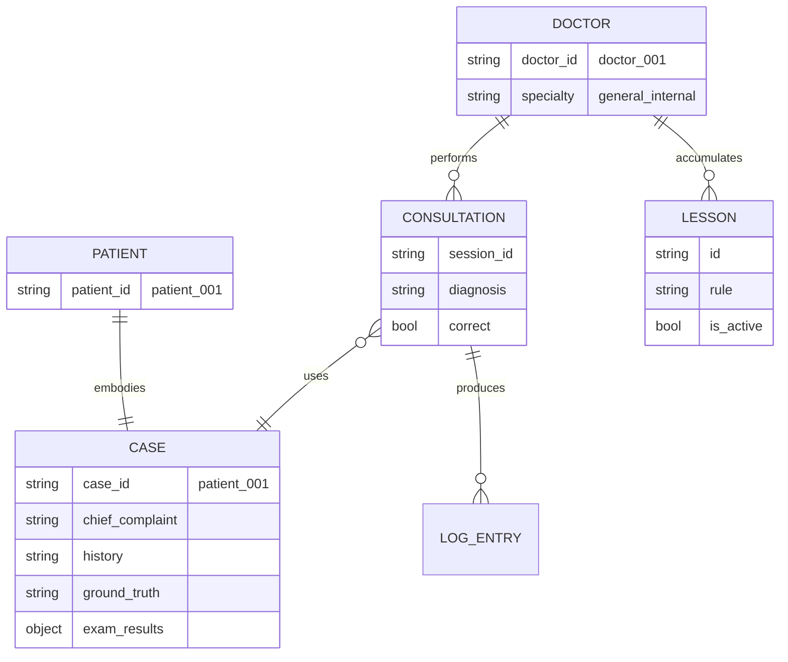

# データ設計（たたき台）

Agent Hospital ミニ再現（`impl/`）のドメインモデルとデータの持ち方の草案。  
**未確定**。実装・症例追加の前にここを固める。

---

## 1. 最初に決める3つ

| 項目 | ミニ版たたき | 備考 |
|------|-------------|------|
| **症例数** | 20 | 訓練 15 + テスト 5 を想定（part2 と同程度） |
| **患者数** | 20 | **症例と 1:1**（1ファイル = 1人 = 1診察シナリオ） |
| **医師数** | 1 | ミニ版は単一の医師エージェント |
| **専門（診療科）数** | 1 | **一般内科** のみ。後から科別に分割可能 |

### 用語

| 用語 | 意味（本プロジェクト） |
|------|------------------------|
| **症例** | 診察シナリオ1件。主訴・既往・検査・正解病名（`ground_truth`）を含む |
| **患者** | 症例を体現する LLM エージェント。ミニ版では症例と同数・同 ID |
| **医師** | Interview ノードの LLM エージェント。教訓（`global_lessons`）を参照する |
| **専門** | 将来、科ごとに教訓・プロンプトを分ける単位。現状は 1 科のみ |

---

## 2. エンティティ関係（たたき）



- **症例 = 患者 ID**（`patient_001.json` が両方のマスタ）
- **1回の `agent-hospital` 実行 = 診察セッション 1 件**
- **教訓**は医師（病院）共通。科が 1 つの間は `global_lessons.json` 1 ファイル

---

## 3. 規模の内訳（たたき）

### 症例 20 件

| 区分 | 件数 | 用途 |
|------|------|------|
| 訓練 | 15 | 診察 → 反省 → 教訓蓄積のループ検証 |
| テスト | 5 | 教訓あり/なしでの診断精度のざっくり確認 |

疾患例（未作成・候補）:

- 帯状疱疹、インフルエンザ、急性虫垂炎、片頭痛、胃食道逆流症 … など

### 医師・専門

| 項目 | 値 |
|------|-----|
| `doctor_id` | `doctor_001`（固定） |
| `specialty` | `general_internal` |
| 教訓ファイル | `storage/doctor/global_lessons.json` |

専門を増やす場合の拡張案（将来）:

```
storage/doctor/
├── global_lessons.json          # 全科共通
└── specialties/
    ├── general_internal.json
    └── dermatology.json
```

---

## 4. データの種類と保存先

設計の順番: **ドメイン（上記）→ エンティティ → ファイル**

| 種類 | 内容 | 寿命 | 保存先（たたき） |
|------|------|------|------------------|
| **症例マスタ** | 主訴・既往・正解・検査 | 固定 | `storage/patients/{patient_id}.json` |
| **教訓** | 過去の反省から得たルール | 永続・追記 | `storage/doctor/global_lessons.json` |
| **診察セッション** | 1 回の問診ログ・診断結果 | 1 実行 | **マスタに混ぜない**（後述） |
| **実行時 state** | turn, diagnosis など | プロセス内 | `invocation_state`（`state.py`） |

### 症例マスタのフィールド（必須）

| フィールド | 読者 | 説明 |
|-----------|------|------|
| `patient_id` | 全体 | `patient_001` 形式 |
| `chief_complaint` | 患者 LLM | 主訴 |
| `history` | 患者 LLM | 既往・経過 |
| `exam_results` | 患者 LLM | 検査・所見（聞かれたら答える） |
| `ground_truth` | Reflection のみ | 正解病名。**患者・医師プロンプトには載せない** |

### 症例マスタに含めないもの

- `consultation_log` — **セッションデータ**。マスタと分離する（現状は同居しており要リファクタ）

---

## 5. ground_truth（正解病名）

シミュレータが裏側で持つ **答え合わせ用ラベル**。論文の Patient/Env が正解を知っているのと同じ役割を、ミニ版では **症例マスタの1フィールド** で表現する。

### 何か

| 項目 | 内容 |
|------|------|
| 定義 | その症例に対する **正しい病名**（1文字列） |
| 例 | `"帯状疱疹"` |
| 誰が書く | 症例作成時（人間 or データセットから転記） |
| 目的 | Reflection で医師の診断が正しかったか判定する |

実臨床の確定診断ではなく、**評価・シミュレーション用の正解データ**。

### 誰が読む・誰が読まない

| ノード | ground_truth |
|--------|--------------|
| Pre-Consult | 読まない |
| Interview（医師 LLM） | **渡さない** |
| Patient/Env（患者 LLM） | **渡さない**（症状だけロールプレイ） |
| Reflection | **ここだけ読む** |

患者・医師のプロンプトに `ground_truth` を載せると、問診の意味がなくなるため禁止。

### フロー

```
Interview（医師）
  → 出力末尾に [DIAGNOSIS: 病名]
  → graph が invocation_state["diagnosis"] に保存

Reflection（Python）
  → 症例マスタから ground_truth を読む
  → diagnosis と文字列比較（現状は strip 後の完全一致）
  → 正解: 教訓は追記しない
  → 誤診: global_lessons.json に教訓を追記
```

### 保存場所

| 場所 | 用途 |
|------|------|
| `storage/patients/{id}.json` の `ground_truth` | **マスタ**（症例ごとに1つ・不変） |
| セッションファイルの `ground_truth` | 評価結果の **コピー**（任意） |
| `consultation_log` の reflection エントリ | 現状の暫定ログ（分離後はセッション側へ） |

マスタ例:

```json
{
  "patient_id": "patient_001",
  "chief_complaint": "左胸に帯状の水ぶくれと痛み",
  "history": "2日前から発熱。以前に水痘の既往あり。",
  "exam_results": { "skin_findings": "左前胸部に帯状分布の水疱" },
  "ground_truth": "帯状疱疹"
}
```

### 症例作成時のルール（たたき）

1. **表記を統一する** — 比較は完全一致。症例20件で病名の書き方を揃える（例: すべて日本語の正式病名）
2. **症状と矛盾しない** — `chief_complaint` / `history` / `exam_results` から妥当な病名にする
3. **同義語は1つに決める** — 「帯状疱疹」と「herpes zoster」は別物扱いになる（将来、別名テーブルを検討）
4. **患者は病名を知らない** — 患者 LLM 用データには症状のみ。正解病名はマスタの `ground_truth` のみ

### 将来の拡張（未実装）

- 表記ゆれ許容（同義語リスト、ICD コード）
- LLM による Reflection（なぜ誤ったかの分析）— 現状は Python の文字列比較 + 固定ルールで教訓生成

---

## 6. 診察セッション（分離案）

マスタ JSON にログを追記し続けると、検証のたびに肥大化する。  
**たたき**: 1 実行 = 1 セッションファイル。

```
storage/
├── patients/
│   └── patient_001.json      # マスタのみ（ログなし）
└── sessions/
    └── patient_001/
        └── 20260702T131500.json   # 1 回の診察ログ
```

セッションファイル（案）:

```json
{
  "session_id": "20260702T131500",
  "patient_id": "patient_001",
  "doctor_id": "doctor_001",
  "started_at": "2026-07-02T13:15:00Z",
  "ended_at": "2026-07-02T13:18:00Z",
  "diagnosis": "帯状疱疹",
  "ground_truth": "帯状疱疹",
  "correct": true,
  "dialogue": [
    {"role": "doctor", "text": "..."},
    {"role": "patient", "text": "..."}
  ]
}
```

---

## 7. 教訓（global_lessons）

| フィールド | 説明 |
|-----------|------|
| `id` | `lesson_xxxxxxxx` |
| `rule` | 教訓本文 |
| `source_patient` | 元症例 ID（任意） |
| `is_active` | 有効フラグ（論理削除） |
| `created_at` | 作成日時（UTC） |

更新ルール（たたき）:

- Reflection で **誤診時のみ** 追記
- 古いルールは `is_active: false`、新規は append-only
- 診察 **開始時**（Pre-Consult）に `is_active: true` だけ読む

---

## 8. 実行時 state（invocation_state）

グラフ実行中だけ使うメモ。`state.py` で型定義。

| フィールド | 設定タイミング |
|-----------|----------------|
| `patient_id` | 起動時 |
| `turn` | Patient/Env 後に +1 |
| `global_lessons` | Pre-Consult |
| `diagnosis` | Interview 確定時（graph） |
| `diagnosis_finalized` | Interview 確定時（graph） |

---

## 9. 現状 impl との差分（TODO）

| 項目 | 現状 | たたき |
|------|------|--------|
| 症例数 | 1（patient_001） | 20 |
| 患者・症例 | 1:1 だが未明示 | 1:1 をドキュメント・ID 規則で固定 |
| 医師・専門 | 暗黙的に 1 人 | `doctor_001` / `general_internal` を明示 |
| ログ | マスタ JSON に append | `storage/sessions/` に分離 |
| 会話履歴 | 直前ノード出力のみ | セッション or state に `dialogue` を持つ（要検討） |

---

## 10. 決めてからやること（チェックリスト）

- [ ] 症例 20 件の疾患リストを確定
- [ ] 各症例の `ground_truth` 表記ルールを決める（日本語正式病名など）
- [ ] `patient_001.json` から `consultation_log` を除去しマスタ化
- [ ] 症例マスタの TypedDict / JSON Schema を `schemas/` に定義
- [ ] セッション保存の有無・パスを確定
- [ ] 症例 JSON を 2 件目以降追加
- [ ] part2.md の数値・構成を本ドキュメントと揃える

---

## 関連

- `../README.md` — 実行方法
- `../../実装検討.txt` — Strands / Graph / Skills 方針
- `../../Qiita投稿/part2.md` — 記事向けミニ版設計
